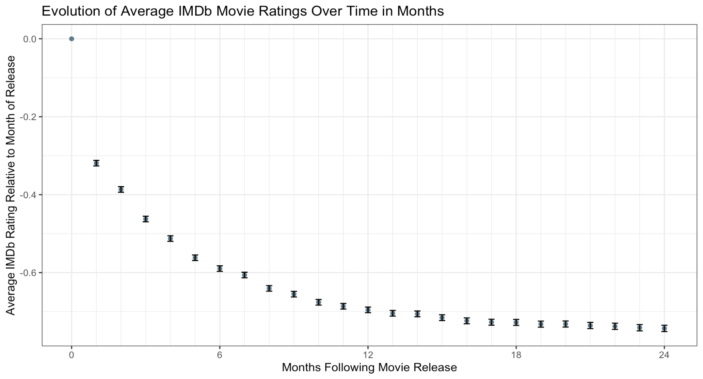

# IMDb_Early_Rating_Bias

This project explores how movie reviews on the Internet Movie Database (IMDb) platform left by early audiences differ from reviews left by later audiences. One reason to expect a difference is that a person watching a newly released movie likely had a high pre-existing interest in the movie that brought them to the theatre, and this pre-existing interest makes them more likely to enjoy the film. This is important because late adopters often use the signals from online review aggregators to make purchasing and consumption decisions. Therefore, being able to anticipate this early ratings bias can help them to make more informed decisions about new products.

To investigate this phenomenon, I explore a dataset of reviews scraped from IMDb. The dataset contains ratings out of ten left by users who write written reviews for movies on the IMDb platform, along with the user and movie IDs, and the date of the rating. To the extent that these written reviews are representative of all IMDb movie ratings, we can use this to quantify the early ratings bias in the aggregate IMDb movie score. I use this dataset to construct a panel of average movie ratings in the periods following their release. Then, using standard panel data estimation techniques while controlling for seasonality and movie-specific effects, I estimate the extent to which the IMDb score of an average movie declines in each month following the movie's release.

I find that the average movie's IMDb score declines by 0.5 points out of 10 in the first four months following the movie's release, with the long term amount of decline roughly stabilizing at 0.76 points out of 10 by three years after the movie's release. The average decline in ratings is summarized in the following figure.

